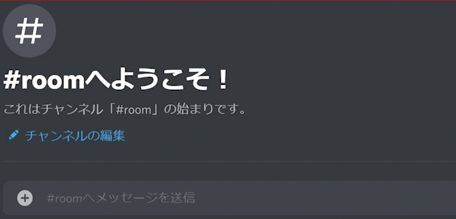

# Discord_Translator_1room  
Discord translator that posts with webhooks that can be deployed on Heroku  
Herokuの無料枠にデプロイできるDiscordの翻訳Botです。  
詳しい使い方はDiscordサーバーに書いてあります。  
  
It supports translation of one channel and posts with the appearance of the author on the Webhook.  
1つのチャンネルの翻訳に対応し、Webhookで発言者の見た目で投稿します。
  

## Environment variable(環境変数)  
  
|Required(必須)||
|---|---|
|DISCORD_TOKEN|Discord bot Token|
|CHANNEL_ID|Channel ID (integer)|
|CHANNEL_URL|URL of the channel of Webhook|
|HOME_LANG|Any language will be translated into this language (e.g. ja)|
|HOME_TO_LANG|Translation language when posted in HOME_LANG language(e.g. en)|
  
|Options(オプション)||
|---|---|
|IGNORE_ID|Author IDs to ignore (":" delimited, integers)|
|GAS_URL|Look at Discord Server|
  
## Other
- [__Discord Server__](https://discord.gg/bhpBKCJV8R)
- [Twitter](https://twitter.com/__Charahiro)
